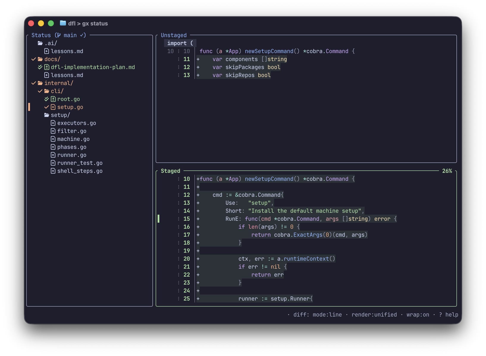
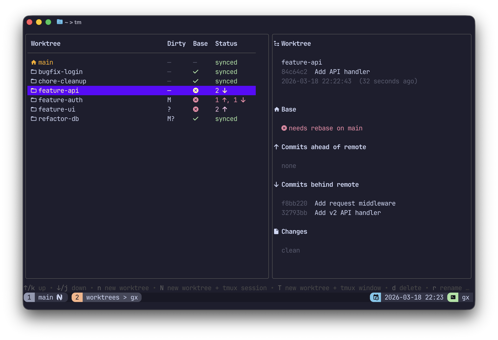

# gx

[](https://github.com/elentok/gx/actions/workflows/ci.yml)


A collection of git helpers (worktree management, staging, etc...)

## Disclaimer

I wrote the original version of the tool in Typescript a while ago but at some
point I realized I wanted something a bit different and had Claude Code migrate it
to Go with a lot of UI changes (see [convert-to-go.md](./docs/prompts/convert-to-go.md)
and [go-migration-plan.md](/docs/go-migration-plan.md)).

## Features

- Browse all linked worktrees in a table with sync status (ahead / behind / diverged) and rebase status relative to main
- Sidebar showing the latest commit (with relative date), commits ahead/behind the remote tracking branch, rebase status relative to main, and uncommitted file changes
- Create, rename, clone, and delete worktrees interactively; select multiple with `space` for bulk delete with a progress modal (optionally opening a new tmux session or window)
- Yank files from one worktree and paste them into another
- Pull, push, and remote-update the selected worktree's branch; pull on a dirty worktree offers to stash first
- Rebase the selected worktree on main (`b`), with optional stash-and-restore for dirty worktrees
- `gx wt clone` clones using the `.bare` directory trick for a clean layout
- `gx wt list` and `gx wt abs-path` for scripting and shell integration
- `gx log` for commit history: amend (`A`), reword (`rw` opens `$EDITOR`), interactive rebase (`ri`), bump version (`B`), pull (`p`), and push (`P`) directly from the log; flashes and re-focuses the entry after amend or reword; `ri` stashes dirty worktrees before launching rebase and prompts to pop the stash when done; commits are colored by status; filter history by file path and line range; yank commit hash (`yh`), subject (`ys`), or full message (`ym`) to clipboard; panel title shows the worktree root
- Press `g p` in any view (worktrees, status, log, commit) to open the GitHub PR for the current context in the browser; merged commits search by hash, unmerged commits use the branch PR
- `gx show` for single-commit inspection with diff navigation; scroll percentage and search counter (`⌕ N/M`) shown in the diff panel title
- `gx status` interactive status UI with file/hunk/line stage + unstage flows
- `gx stash` opens a Stash tab listing the repo's stashes in a split view — apply (`a`), pop (`p`), drop (`d`), or create (`s`) a stash, with the selected stash's diff alongside the list
- Tabbed UI (worktrees, log, status, stash): switch with `1`–`4`, `g w` / `g l` / `g s` / `g S`, or `,` / `.`; switching is flicker-free and tabs reload only when the repo actually changed
- `gx` opens status by default, while `gx worktrees` / `gx wt` open the worktree UI
- Press `/` to search and highlight matching worktrees by name or branch
- Press `g` to open the selected worktree in lazygit
- `gx bump` creates an annotated version tag with an interactive picker (or pass `major`/`minor`/`patch` directly) and optionally pushes
- `gx doctor` checks for and optionally fixes common configuration issues
- Startup check for misconfigured fetch refspec with an option to fix automatically
- Scrollable error modal for any git failures
- See [Changelog](./CHANGELOG.md)

## Screenshots

`gx status`



`gx wt` (worktrees)



## Requirements

- Go 1.21+
- Git
- tmux (optional, for `N` and `T` keybindings)

## Installation

Using homebrew:

```sh
brew tap elentok/stuff
brew install --cask gx
```

Using `go install`:

```sh
go install github.com/elentok/gx@latest
```

```sh
make install
```

## Usage

Run from inside any git repository or bare repo:

```sh
gx
```

This opens `gx status` by default. If launched from inside a worktree, the cursor starts on that worktree.

You can also run the TUI explicitly:

```sh
gx worktrees
gx wt
gx log
gx show HEAD
gx stash
```

`gx stash` opens the Stash tab: a list of the repo's stashes alongside the selected stash's diff. Apply (`a`), pop (`p`), or drop (`d`) the selected stash, or create a new one (`s`); `enter` / `l` focuses the diff panel and `t o` toggles the split orientation.

Open the log pre-filtered to a single file (equivalent to the status `gh` mapping; follows renames so pre-rename history is included). The path is taken relative to your current directory:

```sh
gx log -f path/to/file.go
gx log --file path/to/file.go HEAD   # optionally start at a ref
```

Open the interactive staging UI:

```sh
gx status
```

Status UI highlights:

- Status tree + split Unstaged/Staged diff panes
- Stage or unstage at file, hunk, or line level
- Visual line-range mode (`v`) to stage/unstage selected blocks with `space`
- Discard changes with confirmation (`d`) in status and diff views
- Yank content/location/filename with `yy` / `yl` / `yf`; yank for AI agent with `ya` (wraps diff in a ` ```diff ` block with file/line context)
- Status header shows branch sync at a glance (`✓`, `↑N`, `↓N`, `↑N ↓N`)
- Live search in status/diff with highlights and `n` / `N` navigation
- Vim-like navigation (`j`/`k`, `G`, `ctrl+u`/`ctrl+d` co-scroll) across status, log, and commit views
- Mouse wheel scrolling in diff panes (unstaged/staged, including fullscreen) and in log and commit views
- Toggle unified/side-by-side diff rendering with `s` (supports hunk, line, and visual actions)
- Adjust diff context for the current session with `[` / `]`
- File-to-file diff jumps with `,` / `.`
- Edit selected file in `$EDITOR` with `ee`; open in a horizontal split (`es`), vertical split (`ev`), or new tab (`et`)
- Jump to the top with `g`
- Open lazygit log with `ol`
- View the last command output with `oo`
- Pull/push/rebase/amend/bump actions directly in status (`p`/`P`/`b`/`A`/`B`) with confirmations; push confirms first, then checks divergence if needed
- Stash directly from status: `Sa` stashes all tracked changes (staged + unstaged), `Ss` stashes only staged changes — both prompt for an optional name first
- Push divergence flow uses a menu (`j`/`k` + `enter`) with relative commit times
- Push in status detects GitHub PR URLs and asks whether to open them
- Keyboard help overlay (`?`) and full git-error overlay
- Live action output overlay with cancellation (`ctrl+c`)
- Fullscreen diff hides the status pane
- Focus refresh keeps your diff scroll position

Clone using the `.bare` directory trick and bootstrap the initial worktree:

```sh
gx wt clone <repo-url> [directory]
```

This creates:

```
my-repo/
  .bare/      ← bare git repo
  .git         ← gitdir: ./.bare
  main/        ← initial worktree
```

List worktree names or get the absolute path of one (useful for scripting):

```sh
gx wt list
gx wt abs-path <name>
```

Push current worktree branch; gx confirms first, then checks for divergence before pushing:

```sh
gx push
```

Run the full test suite in a CI-like Ubuntu container:

```sh
make test-docker-ubuntu
```

Stash uncommitted changes, run a command, then auto-pop the stash on success (prompts to pop on failure):

```sh
gx stashify git rebase main
```

Launch a command (or your `$SHELL`) into a tmux/kitty split or tab, falling back to running in place when no multiplexer is available:

```sh
gx term                  # shell, split below (default)
gx term --below nvim     # nvim in a split below, in the current dir
gx term --right lazygit  # lazygit side-by-side
gx term --tab npm test   # npm test in a new tab
gx term --here ls        # run in the current terminal (exec-replace)
gx term --cwd /some/dir lazygit
```

Directions are named by visual outcome (`--right`/`--below`/`--tab`/`--here`), so the same flag produces the same layout on tmux and kitty (which use opposite `hsplit`/`vsplit` conventions internally). `--below` is the default. Splits need tmux or kitty with remote control enabled; on a plain terminal (or kitty without remote control) the command runs in place instead, so the same invocation works everywhere. An explicit command keeps its pane open if it fails; a bare shell does not. With no command, `gx term` opens `$SHELL`.

The headline use case is launching things from neovim. For example, open lazygit in a split below the editor:

```vim
nnoremap <leader>gg <Cmd>!gx term --below lazygit<CR>
```

Manage config (create, edit, inspect):

```sh
gx config edit        # open config in $EDITOR (creates it if missing)
gx config show        # print the effective (merged) config as JSON
gx config defaults    # print the built-in default config as JSON
```

Bump the version tag (interactive picker if no argument given):

```sh
gx bump
gx bump patch   # or minor / major
```

Check the repo for common configuration issues:

```sh
gx doctor
gx doctor --fix   # interactively apply fixes
```

Print the current binary version:

```sh
gx version
```

Generate a shell-completion script (bash, zsh, fish, or powershell):

```sh
gx completion fish | source            # current session
gx completion zsh > ~/.zsh/_gx         # persist
```

## Configuration

Optional config file at `~/.config/gx/config.json` (run `gx config edit` to open it).

| Key                        | Type                            | Default   | Description                                                                                                                                                                                  |
| -------------------------- | ------------------------------- | --------- | -------------------------------------------------------------------------------------------------------------------------------------------------------------------------------------------- |
| `use-nerdfont-icons`       | boolean                         | `true`    | Enable Nerd Font pill-shaped badges and icons throughout the UI.                                                                                                                             |
| `stage-diff-context-lines` | integer (0–20)                  | `1`       | Number of context lines shown around each diff hunk in the staging view.                                                                                                                     |
| `input-modal-bottom`       | integer \| `"N%"` \| `"center"` | `"5%"`    | Vertical position of text-input overlays. An integer is a fixed line count from the bottom; a percentage string (e.g. `"10%"`) is relative to screen height; `"center"` centers the overlay. |
| `name-aliases`             | object                          | `{}`      | Map of exact worktree full-names to display aliases, applied before the normal dash-segment compression.                                                                                     |
| `log.important-refs`       | array                           | see below | Rules for highlighting important refs in the log view. Refs matching a rule get a bright colored badge and are sorted to the front; all others get a dim surface badge.                      |
| `log.hide-refs`            | array of strings                | `[]`      | Regular expressions matched against full ref names. Matching refs are hidden from the log view entirely. Takes priority over `important-refs`.                                               |

### `log.important-refs`

Each rule is an object with:

- `patterns` — list of regular expressions matched against the full ref name
- `color` — badge color: a named Catppuccin color (`blue`, `green`, `yellow`, `orange`, `mauve`, `teal`, `red`, `surface`) or a hex value (`#rrggbb`)

Rules are evaluated in order — the first match wins. The rule order also controls sort priority: refs matching earlier rules appear first in the badge list.

Default:

```json
[
  {
    "patterns": ["^main$", "^master$", "^origin/main$", "^origin/master$"],
    "color": "yellow"
  },
  { "patterns": ["^v\\d"], "color": "blue" }
]
```

Example config:

```json
{
  "$schema": "https://raw.githubusercontent.com/elentok/gx/main/docs/config-schema.json",
  "use-nerdfont-icons": true,
  "stage-diff-context-lines": 3,
  "log": {
    "important-refs": [
      {
        "patterns": ["^main$", "^master$", "^origin/main$", "^origin/master$"],
        "color": "yellow"
      },
      { "patterns": ["^v\\d"], "color": "blue" },
      { "patterns": ["prod", "staging"], "color": "#fab387" }
    ],
    "hide-refs": ["^origin/HEAD$"]
  }
}
```

## Key bindings

| Key            | Action                                                                                  |
| -------------- | --------------------------------------------------------------------------------------- |
| `j` / `↓`      | Move down                                                                               |
| `k` / `↑`      | Move up                                                                                 |
| `n`            | New worktree                                                                            |
| `N`            | New worktree and open a tmux session (switches to it)                                   |
| `T`            | New worktree and open a tmux window                                                     |
| `space`        | Toggle worktree selection for bulk operations                                           |
| `d`            | Delete selected worktree(s) (and their branches); shows progress modal for bulk deletes |
| `r`            | Rename selected worktree and branch                                                     |
| `c`            | Clone selected worktree (copies uncommitted files)                                      |
| `y`            | Yank files from selected worktree into clipboard                                        |
| `p`            | Pull selected worktree's branch (stash prompt if dirty)                                 |
| `P`            | Push selected worktree's branch (confirms before pushing)                               |
| `b`            | Rebase selected worktree on main (stash prompt if dirty)                                |
| `g g`          | Jump to the top of the worktree list                                                    |
| `g p`          | Open the GitHub PR for the selected worktree in browser                                 |
| `oo`           | View output log of the last job                                                         |
| `ol`           | Open lazygit log for the selected worktree                                              |
| `ot`           | Open a tmux session in the selected worktree                                            |
| `/`            | Search worktrees by name or branch                                                      |
| `t`            | Track remote branch (set upstream)                                                      |
| `R`            | Refresh worktree list and statuses                                                      |
| `U`            | Run `git remote update` and refresh                                                     |
| `?`            | Toggle full help                                                                        |
| `q` / `Ctrl+C` | Quit                                                                                    |

### Stash tab

| Key           | Action                                   |
| ------------- | ---------------------------------------- |
| `j` / `k`     | Move down / up through stashes           |
| `enter` / `l` | Focus the diff panel for the stash       |
| `a`           | Apply the selected stash                 |
| `p`           | Pop the selected stash                   |
| `d`           | Drop the selected stash                  |
| `s`           | Create a new stash                       |
| `t o`         | Toggle split orientation                 |
| `esc` / `q`   | Return focus to the list / leave the tab |

### Search mode (after `/`)

| Key           | Action                            |
| ------------- | --------------------------------- |
| (type)        | Filter and highlight matches      |
| `ctrl+n`      | Jump to next match                |
| `ctrl+p`      | Jump to previous match            |
| `enter`/`esc` | Exit search, keep cursor position |

### Paste mode (after `y` + confirm)

| Key       | Action                                    |
| --------- | ----------------------------------------- |
| `j` / `↓` | Move down                                 |
| `k` / `↑` | Move up                                   |
| `p`       | Paste yanked files into selected worktree |
| `esc`     | Cancel and clear clipboard                |

## Development

```sh
make test   # run all tests
make run    # run without building
```
