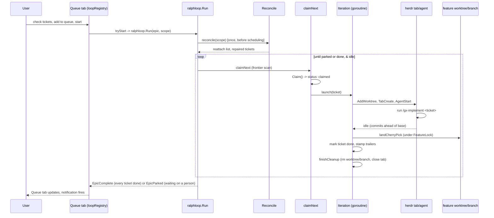
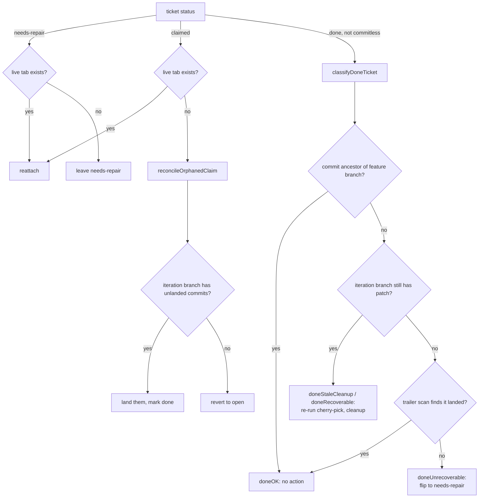
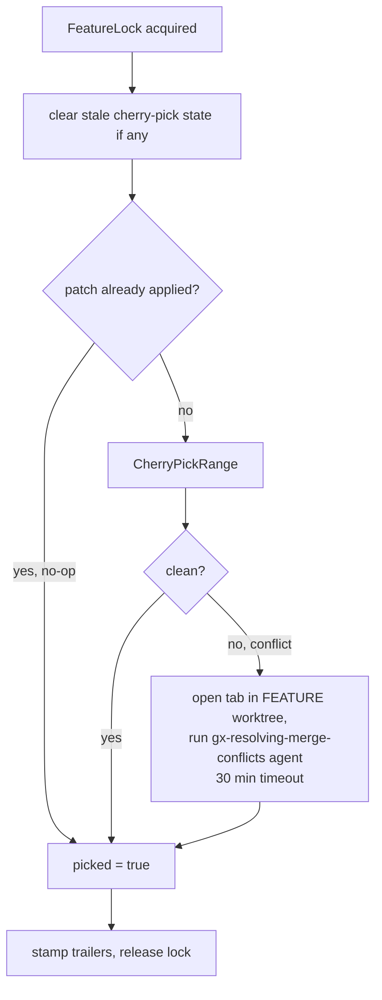
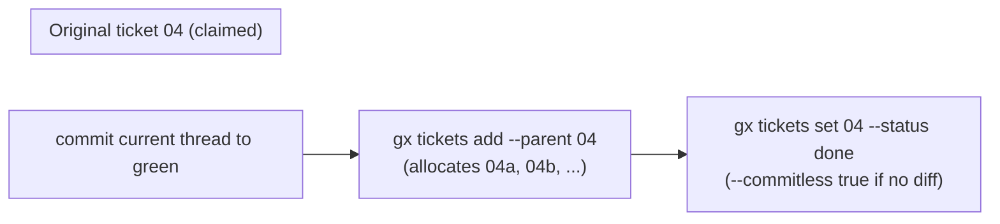
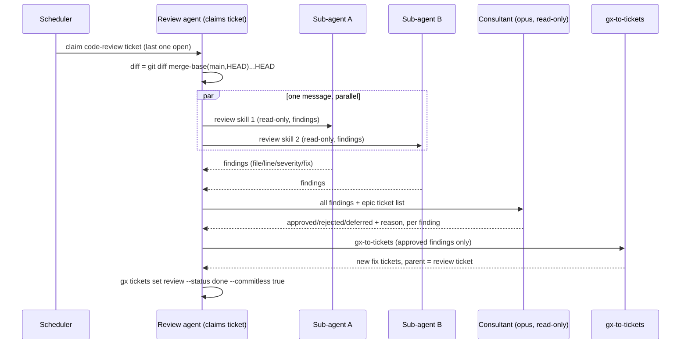
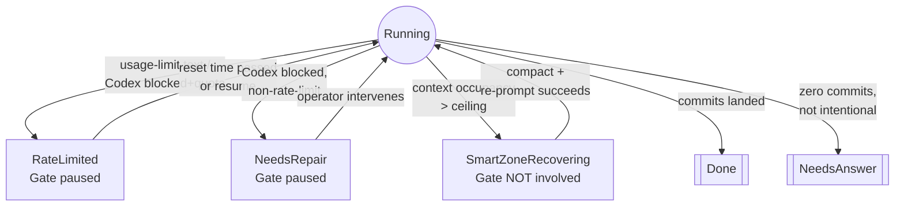
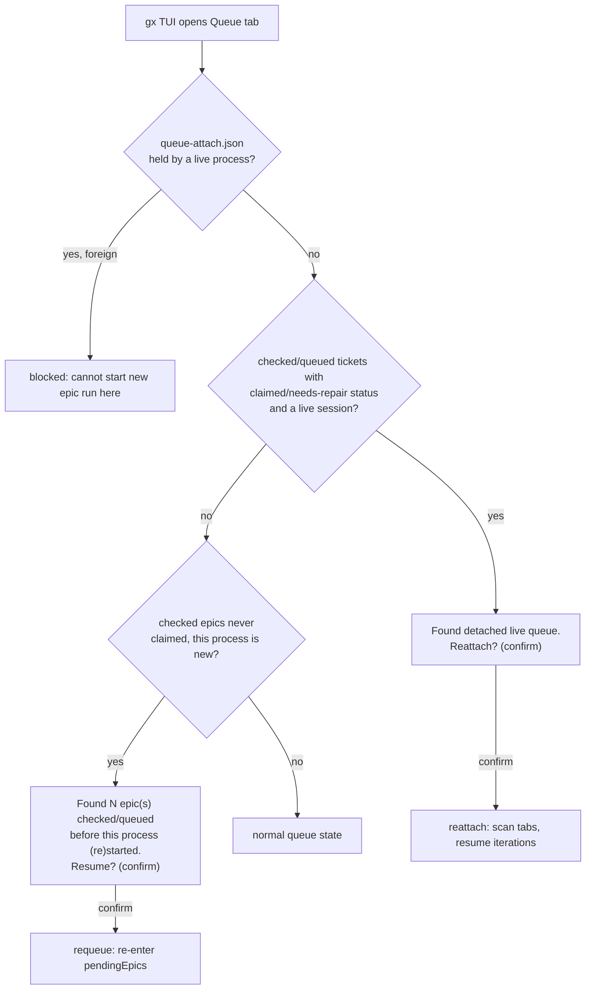

# Ralph-Loop Queue Orchestrator

How the ralph-loop queue orchestrator autonomously drives a batch of tickets to done: terminology,
the core scheduling loop, ticket forking, code review, and the edge cases that show up in
production.

There is no standalone `gx ralph-loop` CLI command anymore — a loop is started from the TUI's
Queue tab: check tickets/epics in the Tickets tab, add them to the queue, and start the run from
there. The Queue tab's `loopRegistry.tryStart` (`ui/tickets/loop_registry.go`) calls
`ralphloop.Run(...)` in-process; everything below describes what that call does once started,
regardless of how it was started.

Code pointers throughout are relative to the repo root. This doc describes mechanics as
implemented; see `CONTEXT.md` for the shorter user-facing glossary (Queue/Attach Lifecycle,
Ticket Forking sections) this doc expands on.

## 1. Terminology

| Term | Meaning |
|---|---|
| **Epic** | A named unit of work: a directory `.scratch/<epic>/issues/*.md` of tickets, plus one shared **feature worktree/branch** checked out for the epic's lifetime. |
| **Ticket** | One markdown file with frontmatter (`status`, `blocked_by`, `parent`, `type`, ...) describing one unit of agent work. |
| **Epic run** | One call to `ralphloop.Run(...)`, started by the Queue tab (`loopRegistry.tryStart`) when the user starts a queued epic. Drives every unblocked ticket in that epic (or a narrower `RunScope`) to completion, up to `MaxParallel` concurrently (default 2). |
| **Iteration** | The lifecycle of one ticket being worked: its own worktree, branch, herdr tab, and agent session, from claim through landing (or a stall). |
| **Iteration worktree/branch** | Per-ticket git worktree (`{worktreeDir}/{epic}-item-{identifier}`) on branch `ralph-loop/{epic}-item-{identifier}`, created fresh off the feature branch's current tip. |
| **Claim** | Atomically writes `status: claimed` on a ticket, taking it off the frontier so no other scan can pick it up. |
| **Landing** | Cherry-picking a finished iteration branch's commits onto the shared feature worktree/branch (never a merge — always cherry-pick). Distinct from merging the epic into `main`, which is a separate later step (`gx merge` / `gx-merge` skill). |
| **Frontier** | The set of tickets currently eligible to claim: `RenderedStatus == Open`, filtered to the run's `RunScope`. |
| **RunScope** | Which tickets an epic run is allowed to claim — the whole epic, or a restricted `TicketIDs` set (e.g. Queue tab's "Add to queue"). Automatically widens to include any ticket reached by walking `parent`, so forked children are always in scope even if not named explicitly. |
| **Parked** | A ticket whose `RenderedStatus` is `NeedsAnswer`, `NeedsRepair`, or `Draft` — waiting on a person, not runnable, and not retried on its own (`isParked`). An epic parks when every in-scope ticket left is parked or blocked, and keeps waiting rather than exiting; only a run with no runnable work *and* nothing parked is **deadlocked**, which is a hard error. See CONTEXT.md's Ticket States section. |
| **Fork** | Splitting a ticket into sibling tickets mid-flight because it outgrew its budget or turned out to mix concerns. Produces one `parent` edge per new ticket, written on the new ticket; nothing is recorded on the original. |
| **Fork subtree** | A ticket plus every ticket reached by following `parent` reverse-edges down from it, at any depth. The unit `Blocking` recurses over: a `blocked_by` token resolves only once the named ticket's whole fork subtree is done. |
| **Reconcile** | The pass that runs once at the start of every epic run, before scheduling starts, reconciling on-disk `status:` against live herdr sessions and git reality (crash recovery). |
| **Gate** | The in-process pause/resume coordinator for one epic run. Something can be paused for rate-limit or needs-repair reasons; a smart-zone breach is handled differently and does **not** use the Gate (see §6). |
| **Attach / Attached** | At most one `gx` process, repo-wide, may be "attached" to the Queue at a time — the process running the first live epic. Recorded in `.scratch/queue-attach.json` (pid + start time). |
| **RenderedStatus** | The Queue/Tickets UI's collapse of raw `status:` + graph-derived overlays into: Open, Claimed, Blocked, NeedsAnswer, NeedsRepair, Done, Draft, Waiting-for-children, Error. Blocked and Waiting-for-children are overlays — derived per render, never written to a file. |

## 2. The core loop

**Claim → launch → land, per ticket** (`ralphloop/loop.go`, `claim.go`, `launch.go`,
`iteration.go`):

1. `claimNext` reloads the epic from disk, computes `scope.Frontier(epic)` (open, unblocked,
   in-scope tickets sorted by number), and claims the first one not already tracked in-memory.
   Every scan is logged (`eventSchedulerScan`) with a per-ticket reason: `claimed`, `frontier`,
   `blocked`, `out-of-scope`, `done`, `stalled` (parked, in the log's own literal decision string),
   `unclaimed`.
2. `launch` spins up a goroutine: new iteration worktree off the feature branch's current tip,
   dependency install (npm/pnpm/yarn/poetry/uv, detected from marker files), a herdr tab, an
   agent session (Claude or Codex), and the skill prompt `/gx-implement <ticket-path>`.
   `waitForFinish` blocks until the agent reaches a finish state, absorbing rate-limit pauses,
   needs-repair pauses, and smart-zone breaches along the way (§6).
3. `finishIteration`: zero commits + `Commitless: true` → treat as an intentional zero-diff
   finish (e.g. fork-and-close, or a code-review ticket); zero commits otherwise → mark
   `needs-answer`, leave the worktree for a human. Commits present → cherry-pick onto the
   feature branch (§4 for conflicts), stamp `Ralph-Loop-Ticket`/`-Tokens`/`-Elapsed` trailers,
   mark `done`, clean up the iteration worktree/branch/tab.
4. The epic run's own loop keeps re-scanning while there is runnable or parked work in scope. Once
   nothing in scope is runnable, a parked ticket keeps the epic waiting on a person (`EpicParked`,
   no timeout) instead of exiting; nothing runnable *and* nothing parked is a deadlock error. If the
   *whole* epic (not just this run's scope) is done, `EpicComplete` fires and `epic.yaml` gets a
   `completed_at` stamp.

One epic → one feature worktree/branch. One ticket-iteration → its own worktree, branch, herdr
tab, and agent session. Up to `MaxParallel` iterations run concurrently under one epic run.

## 3. Reconciliation (crash recovery)

There is no separate "what's in flight" state file — a ticket's `status:` frontmatter is the only
durable record, and it can drift from reality across a crash or killed terminal. `reconcile` runs
once, synchronously, at the start of every epic run, before any new claim is made.

Presence-checking a "done" ticket's commit uses a three-tier fallback: is the recorded SHA still
an ancestor of the feature branch tip; if rebased, is the iteration branch patch-equivalent; if
that's gone too, does a trailer scan (`Ralph-Loop-Ticket`, `landed.go`) still find it. A ticket is
**never** silently reverted to `open` after work was actually done — the unrecoverable case goes
to `needs-repair` for a human instead, so a first attempt is never silently discarded.

## 4. Landing and conflict resolution

Landing = cherry-picking `base..iteration-branch` onto the shared feature worktree, under a
`FeatureLock` so only one ticket touches it at a time.

Conflict resolution runs a *separate* agent session in the feature worktree itself (where the
conflict markers actually are, not the iteration worktree) — same launch/wait machinery as a
normal iteration, but capped at 30 minutes so a hung resolution surfaces as an actionable error
instead of stalling the whole epic.

## 5. Ticket forking and code review

Neither forking nor code review has special-case scheduler code — both are ordinary agent-driven
conventions on top of the same frontier/claim mechanism. The scheduler doesn't know either concept
exists; it only ever sees ticket files and frontmatter.

### Forking

Triggered by the `gx-implement` skill itself, mid-iteration, when:
- context usage crosses ~90K tokens (headroom under the 130K smart-zone ceiling), checked at
  natural checkpoints, or
- a kind-mismatch is discovered — the ticket turns out to need different plumbing than planned,
  independent of token count.

Each new ticket's `blocked_by` includes the original's id, and fork-suffix allocation
(`tickets/allocate.go`) follows: bare number → next letter (`04`→`04a`,`04b`); lettered → next
number under that letter (`04b`→`04b1`). Nothing needs to "notice" the fork — the next
`claimNext` scan reloads the epic from disk and sees the new files, and `blocked_by: 04` only
resolves once **04 and every ticket whose `parent` chain reaches it, recursively**, are done — so a
ticket blocked on the pre-fork original transparently waits for every one of its forked descendants too, while
excluding the forking ticket's own fork-family from that recursive check (so it never deadlocks
against its own not-yet-created follow-on work).

### Code review, sub-agents, and the consultant

A `type: code-review` ticket carries no `blocked_by` — instead it's specially blocked as long as
*any other ticket in the epic* isn't done yet, and becomes eligible the moment everything else in
the epic reaches `done`. It's the natural last ticket of an epic (`cmd/tickets_ensure_code_review.go`
creates one automatically if the epic doesn't have one).

Key points:
- Sub-agent skills are configured per-repo (`.skills["code-review"]`, defaults to
  `["thermo-nuclear-code-quality-review"]`), fired as parallel `Agent` calls in one message.
- The **consultant** is a single fresh-context, read-only subagent, explicitly run at the
  highest-tier model — it never edits anything. Its job is to de-duplicate, prioritize by actual
  impact (not vote count across reviewers), and issue an approve/reject/defer decision per
  finding with a one-line reason.
- Only **approved** findings become new tickets, parented to the review ticket (`parent` on the new
  ticket — the same frontmatter edge as a fork, but semantically this is "fix tickets a code-review
  ticket opened," not a mid-flight split).
- The review ticket always closes `--commitless true` — it never produces code itself.

## 6. Pauses, rate limits, and notifications

Three distinct "something needs attention" mechanisms exist; only two of them use the shared
`Gate`:

| Mechanism | Uses Gate? | Effect on rest of epic | Auto-clears? |
|---|---|---|---|
| **Rate limit** (`PauseRateLimit`) | yes | scheduler stops claiming; running iterations keep going to their own next pause point | yes, once the parsed/estimated reset time passes, or manual resume |
| **Needs-repair** (`PauseNeedsRepair`) | yes | same — scheduler-wide pause | only via operator intervention |
| **Smart-zone breach** (context ceiling) | **no** | only that one iteration pauses (Ctrl-C, compact, "finish up" re-prompt); other tickets keep being claimed and run normally | yes, automatic — it's a self-contained recovery loop, not a scheduler stall |

Gate mechanics: any iteration can call `pause(label, reason)` independently. While any label is
paused, the scheduler refuses new claims. Every paused iteration blocks on a shared channel and is
released together the instant `ForceResume` clears the last paused label. Resume is entirely
in-process (`Gate.ForceResume`) — there is no headless/file-based resume path. The Queue tab UI
drives a dedicated `QueuePauseLabel` through the same mechanism for its own pause/resume button.

**Notifications** (`ralphloop/notify.go`, `notification_text.go`): `EventSink` is the single
interface every lifecycle event flows through. A Telegram/Slack sink wraps another sink, forwards
everything, and additionally fires a chat message for `IterationFinished`, `IterationPaused`,
`TicketNeedsAnswer`, `EpicComplete`. Sends are fire-and-forget, retried once, and every attempt
(success or failure) is durably logged to `run-log.jsonl`. A recent bug (`e266213`) had
`epicCompleteText` embedding a literal, unescaped `(` in the MarkdownV2 payload — Telegram's API
rejected every epic-complete send with a deterministic 400. Diagnosed straight from
`run-log.jsonl`: iteration-finished sends showed `notification-sent`, epic-complete showed
`notification-failed`. Fixed by dropping the offending punctuation from the template.

## 7. Queue tab: attach, live, reattach

One Queue per repo (not per epic), keyed off `.scratch`. At most one `gx` process may be
**attached** at a time — the process running the epic's first live run. This is a soft lock
against two processes scheduling the same epic concurrently, not a hard filesystem lock: it's
tracked in `.scratch/queue-attach.json` (pid + process start time, so a reused pid after reboot
isn't mistaken for the same process).

- **Replace queue** (`r`) clears pending+done selection and replaces it with the checked
  tickets — blocked repo-wide while *any* epic run is live, so a running epic's own state can't be
  silently discarded.
- **Add to queue** (`a`) widens an already-running epic's `RunScope` with newly-checked tickets —
  requires a live run under the cursor's epic already.
- **Live** = a claimed/needs-repair ticket whose herdr session is still alive, as found by
  `ralphloop.ScanForReattachable`. This is what "reattach" recovers from: the *process* died but
  the tmux/herdr session it launched didn't.

## 8. Edge case: process-restart-stranded pending epics

Real bug, fixed in `da7c6d8` — worth walking through because it illustrates why some of this state
is deliberately ambiguous on disk.

The Queue tab keeps a list of checked-but-not-yet-started epics (`pendingEpics`) **purely in
memory**, waiting for a `MaxConcurrentEpics` slot to free. If the `gx` process restarts while an
epic is sitting in that queue — before its turn ever comes — the epic silently vanishes: the
durable "checked" selection survives in `queue-state.json`, but nothing re-derives `pendingEpics`
from it on the next load.

The subtlety: **"checked, Enter never pressed" and "checked, was queued, restarted before its
turn" look identical on disk.** A first fix attempt auto-requeued on the checked signal alone and
broke a test by auto-starting epics whose Enter had genuinely never been pressed. The shipped fix
mirrors the existing detached-live-queue pattern instead of trying to disambiguate silently: scan
once per process on first Queue-tab load for checked-but-unclaimed-and-not-running epics
(excluding anything already covered by the live-reattach scan), and surface an explicit confirm
dialog rather than resuming automatically.

**Lesson for future edge cases in this system**: when on-disk state can't distinguish two
histories that call for different actions, don't guess — surface a confirm prompt naming what was
found, the same pattern used for live-session reattach.

## 9. File map

| Concern | Files |
|---|---|
| Core loop, claiming, launching | `ralphloop/loop.go`, `claim.go`, `launch.go`, `iteration.go`, `schedule.go`, `scope.go` |
| Reconciliation | `ralphloop/reconcile.go`, `reconcile_claim.go`, `reconcile_classify.go`, `reconcile_repair.go` |
| Landing / conflicts | `ralphloop/landed.go`, `iteration.go` (`cherryPickWithConflictResolution`) |
| Pause / rate limit | `ralphloop/pause.go`, `ratelimit.go`, `waitforfinish.go` |
| Notifications | `ralphloop/notify.go`, `notification_text.go`, `telegram_eventsink.go` |
| Wave preview | `ralphloop/plan.go` |
| Ticket status/blocking | `tickets/status.go`, `tickets/epic.go`, `tickets/allocate.go` |
| Fork/review skills | `skills/gx-implement/SKILL.md`, `skills/gx-code-review/SKILL.md` |
| Queue tab UI | `ui/tickets/queue*.go`, `loop_registry.go`, `attach_lock.go`, `reattach_scan.go` |
